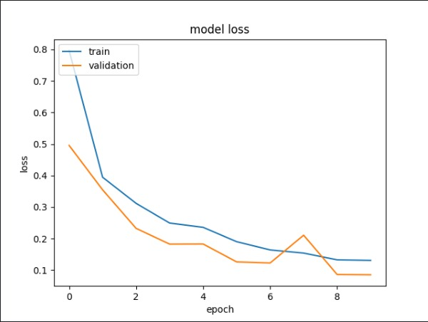

  

<h1 align="center">FruityFit</h1>

CH2-PS327

## CH2-PS327 Contributors

| Name  | Bangkit-ID | Learning Path  | 
| :---: | :---: | :---: |
|  Evander Gabriel  | M239BSY0797  | Machine Learning  |
|  Christopher Ade Wiyanto  | M239BSY1097  | Machine Learning  |
|  Sonya Oktavia  | M200BSX1152  | Machine Learning  |
| Danar Hadi Bachtiar | C253BSY3294 | Cloud Computing |
| Muhamad Arya Al Ghifari Wibowo | C134BSY3568  | Cloud Computing |
| Melisa Wijaya | A239BSX2324 | Mobile Development |
| Adam Rayhant Laksono | A009BSY2477  | Mobile Development |

## Machine Learning
### 1. Fruit Classifications

  
  

### Steps
1. Collect dataset
2. Make 2 folders for test and train
3. Make folders in each folders as much classes and name it.
4. Use ImageDataGenerator to augment the images dataset 
5. Tensorflow to build the ML model using CNN 
6. Make the REST API using Flask

### 2. Fruit Freshness Classifications

  
  

### Steps
1. Collect dataset
2. Make 2 folders for test and train
3. Make 2 folders in each folder because we want binary and name it True or False.
4. Use ImageDataGenerator to augment the images dataset 
5. Tensorflow to build the ML model using CNN 
6. Save to SavedModel then convert to tensorflow.lite

### 3. Chatbot